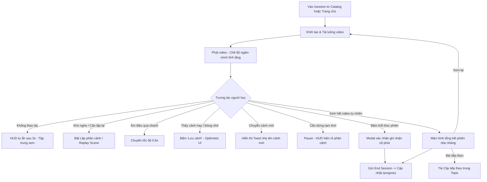

# PRODUCT.md — CI Learning Loop & Player Experience

## 1. Purpose

### Trải nghiệm được nghiên cứu
Tài liệu này đặc tả trải nghiệm **Vòng học CI & Video Player tương tác phân cảnh** (CI Learning Loop & Player Experience) trong sản phẩm JPLearn. Trải nghiệm này bao gồm:
1. Phát video nhập ngữ liệu dễ hiểu (Comprehensible Input - CI) theo cấp độ (Cấp 0 – 5).
2. Điều hướng và lặp lại phân cảnh tình huống (Scene Replay & Auto-Loop).
3. Đánh dấu lưu cảnh yêu thích (Scene Bookmarking) để tích lũy kho ngữ liệu cá nhân.
4. Điều chỉnh tốc độ nghe (1.0x và 0.8x) mà không méo cao độ âm thanh.
5. Ghi nhận thời gian ngâm ngôn ngữ thực tế (Active Immersion Minutes) một cách trung thực, minh bạch, không dùng cơ chế gamification độc hại.

### Vấn đề của người học (User Problem)
Người học tiếng Nhật trưởng thành theo phương pháp Comprehensible Input cần một môi trường xem video tập trung cao độ, nơi họ có thể tiếp nhận ngôn ngữ tự nhiên thông qua ngữ cảnh (hình ảnh, biểu cảm, cử chỉ, tình huống) thay vì dịch sang tiếng mẹ đẻ (L1).
* **Bất cập của trình phát video thông thường (YouTube, Netflix):** Thiết kế cho việc xem thụ động liên tục; khi người học không bắt kịp một câu hoặc một tình huống ngắn, việc tua lại 5s hay 10s bằng thanh trượt rất vụng về, dễ tua quá tay hoặc bỏ lỡ đoạn hội thoại.
* **Bất cập của các công cụ học ngoại ngữ hiện nay (eJOY, Migaku, Language Reactor, Mazii):** Quá tải thông tin phụ trợ. Các công cụ này lập tức hiển thị phụ đề dịch nghĩa tiếng Việt/tiếng Anh, bảng tra từ điển pop-up, phân tích ngữ pháp, bài tập điền từ và flashcard Anki. Điều này ép người học chuyển từ chế độ **"thụ đắc tự nhiên"** (Acquisition) sang chế độ **"phân tích học thuật"** (Grammar Translation), phá vỡ *Silent Period* (thời kỳ im lặng) và phản xạ ngôn ngữ.

### Vị trí trong sản phẩm JPLearn
Trình phát phiên học CI (màn hình `S-SESSION`, route `/session`) là **trung tâm giá trị cốt lõi** của JPLearn. Mọi hoạt động từ chọn lọc bài học ở Catalog (`/catalog`) cho đến đo lường số phút tích lũy ở Tiến độ (`/progress`) đều xoay quanh trải nghiệm tại trình phát này.

---

## 2. Existing Product Context

### Điểm vào (Entry Points)
* **Từ Catalog (`/catalog`):** Người học duyệt danh mục theo cấp độ CI (`ci_level` 0–5) hoặc chủ đề tình huống (`daily_home`, `shopping`, `food`,...). Bấm thẻ bài học hoặc nút "Học ngay" sẽ chuyển hướng đến `/session?item_id={catalog_item_id}`.
* **Từ Landing Page (`/`):** Nút CTA "Bắt đầu học ngay" dẫn trực tiếp đến phiên học của nội dung mẫu hoặc nội dung đang học dở.
* **Khôi phục phiên tự động (Session Recovery):** Khi người học mở lại `/session` sau khi đóng tab hoặc tải lại trang, hệ thống đọc `sessionStorage` và xác thực với backend để khôi phục phiên đang phát dở.

### Luồng người dùng hiện tại (Current-state flow)
```
Catalog (/catalog) 
   ──► Chọn bài 
   ──► /session?item_id=... 
   ──► Kiểm tra phiên & Khởi tạo phiên
   ──► Tải luồng media (HLS / MP4 fallback) 
   ──► Video tự động phát (hoặc bấm Play)
   ──► Người học xem video
   ──► Bấm "Kết thúc phiên" 
   ──► Chốt số phút & Chuyển về /progress
```

### Thuật ngữ hiện hành (Existing Terminology)
* **Phút CI / `minutes_comprehensible`:** Số phút tiếp xúc ngữ liệu dễ hiểu thực tế được server kiểm chứng qua cơ chế heartbeat định kỳ 15s (không tính thời gian pause, seek, buffer).
* **Cấp CI / `ci_level`:** Thang đo từ Cấp 0 (hoàn toàn trực quan, từ đơn, cử chỉ rõ) đến Cấp 5 (ngôn ngữ tự nhiên tốc độ chuẩn).
* **Phân cảnh / `scenes`:** Các trích đoạn tình huống có ý nghĩa trong một clip, được gắn nhãn thời gian bắt đầu (`start_time_seconds`), kết thúc (`end_time_seconds`), và tiêu đề tiếng Nhật (`title_jp`).
* **Lưu cảnh / `saved_scenes`:** Hành động đánh dấu một phân cảnh vào bộ sưu tập cá nhân.
* **Chủ đề tình huống / `topic`:** Ngữ cảnh đời sống thực tế (`daily_home`, `food`, `shopping`, `travel`, `culture`, `work`,...).

### Quy ước tương tác & Thẩm mỹ sẵn có
* **Thẩm mỹ Tonmana Nhật đương đại:** Nền màu kem nhã nhặn (`var(--cream-bg)`), màu xanh sage (`var(--green)`), viền và chữ màu than chì đậm (`var(--charcoal)`), các khối card có đổ bóng cứng (`var(--shadow-solid)`).
* **Giao diện tối giản (Minimalist Chrome):** Thanh điều hướng gọn gàng; không có hiệu ứng gamification lòe loẹt, không huy hiệu XP, không hoạt hình chúc mừng kiểu nổ pháo hoa.
* **Đa bề mặt (Three Surfaces):**
  * *Web (Lean-forward):* Thao tác chuột/bàn phím thuận tiện, danh sách phân cảnh hiển thị cạnh hoặc dưới player.
  * *iPad (Lean-back):* Không gian video chiếm ưu thế, điều khiển chạm nhẹ nhàng, ngả lưng xem ngữ cảnh hình ảnh.
  * *Phone (On-the-go):* Tối ưu hiển thị dọc, thanh phân cảnh dạng bottom-sheet hoặc trượt ngang.

### Ranh giới UX & Ràng buộc sư phạm (Pedagogical Boundaries)
Tuân thủ nghiêm ngặt [docs/pedagogy/bible.md](file:///Users/quyendo/Documents/Learn/JPLearn/docs/pedagogy/bible.md) và [docs/sad/03-design/ui-shell.md](file:///Users/quyendo/Documents/Learn/JPLearn/docs/sad/03-design/ui-shell.md):
1. **Tuyệt đối KHÔNG có phụ đề tiếng Việt / tiếng Anh (L1):** Không cung cấp nút bật/tắt dịch nghĩa. Nghĩa phải đến từ hình ảnh, âm thanh và ngữ cảnh.
2. **Tuyệt đối KHÔNG có pop-up từ điển tra nghĩa:** Tránh biến phiên nghe thành buổi tra cứu từ vựng.
3. **Tuyệt đối KHÔNG có câu hỏi kiểm tra ngữ pháp / quiz giữa chừng:** Không cắt ngang luồng chú ý (Immersion Flow).
4. **Bảo vệ Silent Period:** Không có nút "Luyện nói", không nhắc "Lặp lại theo tôi" khi chưa có cờ sư phạm riêng.

---

## 3. Target User Experience

### Tầm nhìn trải nghiệm (Product Experience)
Mục tiêu là tạo ra một **"Phòng ngâm ngôn ngữ tĩnh lặng" (Immersion Sanctuary)**:
* **Rõ ràng (Clarity):** Người học luôn biết mình đang ở đâu trong video, phân cảnh hiện tại thuộc tình huống nào, và còn bao nhiêu giây trong phân cảnh đó.
* **Tự chủ & Tự tin (Confidence):** Người học không sợ bị "ngợp" trước tốc độ nói của người bản xứ. Chỉ với một cú chạm hoặc phím tắt duy nhất, họ có thể yêu cầu phát lại chính xác phân cảnh vừa rồi bao nhiêu lần tùy thích mà không cần căn chỉnh thanh trượt.
* **Tối thiểu nỗ lực (Effortless Control):** Các nút điều khiển chính (Xem lại cảnh, Lặp cảnh, Lưu cảnh, Tốc độ 0.8x) được bố trí ngay trong tầm với ngón tay cái trên di động hoặc các phím tắt tiêu chuẩn trên máy tính.
* **Tập trung sâu (Immersion Flow):** Toàn bộ giao diện điều khiển tự động ẩn sau 3 giây không có thao tác khi video đang phát, nhường 100% không gian thị giác cho hình ảnh video.
* **Ghi nhận nhẹ nhàng (Mindful Progression):** Kết thúc phiên học không phải là màn chúc mừng ồn ào mà là bản tổng kết êm dịu về số phút đã đắm mình trong tiếng Nhật, giúp người học duy trì sự điềm tĩnh và bền bỉ.
* **Hồi phục liền mạch (Graceful Recovery):** Dù mạng chập chờn hay đổi luồng HLS sang MP4, video tự động kết nối lại tại đúng vị trí mili-giây gần nhất mà không làm mất số phút đã tích lũy.

---

## 4. User Journey

### Hành trình người dùng từ đầu đến cuối (End-to-End Journey)



### Các nhánh rẽ quan trọng (Meaningful Branches)
1. **Nhánh Lặp cảnh (Loop Branch):** Khi bật chế độ Lặp cảnh, video tự động tua về đầu cảnh khi chạm mốc kết thúc cảnh. Người học có thể nghe đi nghe lại 3–5 lần cho đến khi bộ não phân tách được các âm tiết mà không cần nhìn chữ.
2. **Nhánh Rời phiên sớm (Early Exit Branch):** Khi người học bấm "Kết thúc phiên" giữa chừng, hệ thống không trừng phạt hay cảnh báo tiêu cực; modal xác nhận thông báo rõ: *"Số phút bạn đã nghe (X phút) vẫn được ghi nhận trọn vẹn"*.
3. **Nhánh Mất kết nối / Xung đột thiết bị (Conflict/Recovery Branch):** Nếu người học mở app trên thiết bị thứ 2, phiên trên máy hiện tại dừng nhẹ nhàng với thông báo rõ ràng; nếu mạng rớt, cơ chế phục hồi tự động chuyển sang luồng MP4 và tiếp tục phát.

---

## 5. Flow Specification

### Flow 1: Lặp & Xem lại phân cảnh (Scene Replay & Loop)
* **Trigger:** Người học bấm nút "Lặp cảnh" trên thanh điều khiển player hoặc bấm phím `L` (trên Web), hoặc bấm vào một phân cảnh trong danh sách.
* **Các bước:**
  1. Người học nhận diện một câu nói bản xứ chưa nghe rõ.
  2. Bấm "Lặp cảnh" (icon Loop phát sáng viền xanh).
  3. Trình phát tiếp tục phát đến `end_time_seconds` của cảnh hiện tại, sau đó ngay lập tức chuyển vị trí về `start_time_seconds` và tiếp tục phát.
  4. Một nhãn nhỏ (Badge) *"Đang lặp cảnh X"* hiển thị góc trên player.
  5. Khi người học đã cảm thấy quen tai, bấm nút "Lặp cảnh" một lần nữa để tắt. Video tiếp tục phát sang cảnh tiếp theo bình thường.
* **Điểm quyết định (Decision Points):**
  * Nếu người học bấm phím `R` (Replay) hoặc nút "Xem lại cảnh": Video nhảy ngay lập tức về `start_time_seconds` của cảnh hiện tại mà không bật chế độ lặp vô tận.
  * Nếu người học bấm vào một cảnh khác trong danh sách: Video lập tức nhảy đến `start_time_seconds` của cảnh đó; nếu đang bật Lặp cảnh thì phạm vi lặp chuyển sang cảnh mới này.
* **Điều kiện thoát:** Bấm tắt chế độ lặp hoặc video bị dừng thủ công.
* **Xử lý sự cố:** Nếu metadata phân cảnh bị thiếu, nút "Lặp cảnh" bị mờ (disabled) và thông báo tooltip *"Nội dung này chưa có dữ liệu phân cảnh"*.

### Flow 2: Đánh dấu lưu cảnh (Scene Bookmarking)
* **Trigger:** Người học bấm nút "Lưu cảnh" (icon Bookmark) trên player hoặc trong danh sách phân cảnh.
* **Các bước:**
  1. Người học nhận diện cảnh phim thực tế sinh động muốn nghe lại sau.
  2. Bấm "Lưu cảnh".
  3. **Optimistic UI:** Icon bookmark đổi trạng thái sang *"Đã lưu"* (nền xanh, icon checkmark) ngay lập tức trong 50ms, không làm gián đoạn hay khựng video.
  4. Một thông báo nhỏ (Micro-toast) trượt vào ở góc dưới player: *"Đã lưu vào Cảnh của bạn"*.
  5. Request `PUT /me/saved-scenes/{scene_id}` gửi ngầm trong background.
* **Xử lý sự cố:** Nếu request thất bại sau 3 lần retry ngầm, icon trở về trạng thái cũ và hiển thị thông báo nhẹ: *"Chưa thể lưu, vui lòng thử lại khi có mạng"*.

### Flow 3: Điều chỉnh tốc độ nghe (Auditory Speed Adjustment)
* **Trigger:** Bấm nút chuyển đổi tốc độ trên player (phím tắt `[` hoặc `]`).
* **Các bước:**
  1. Người học bấm nút tốc độ (mặc định hiển thị `1.0x`).
  2. Tốc độ chuyển đổi giữa 2 mức: `1.0x` (Chuẩn) và `0.8x` (Chậm).
  3. Video thay đổi tốc độ mượt mà với thuật toán bảo toàn cao độ âm thanh (Pitch Correction), giọng nói không bị ồm hay biến dạng.
  4. Nhãn hiển thị cập nhật rõ ràng: `0.8x (Chậm)`.
* **Quyết định thiết kế:** Không dùng thanh trượt vô cấp (0.5x, 0.75x, 1.25x, 1.5x) vì gây xao nhãng; người học CI chỉ cần 2 mức: tốc độ bản xứ thực tế và tốc độ chậm hỗ trợ tai mới nghe.

### Flow 4: Tạm dừng, Thoát sớm & Khôi phục phiên (Pause, Exit & Recovery)
* **Trigger:** Người học bấm Pause, hoặc bấm nút "Kết thúc phiên" trên thanh điều hướng.
* **Các bước khi Thoát sớm:**
  1. Người học bấm "Kết thúc phiên".
  2. Video tự động tạm dừng.
  3. Modal hiển thị:
     * Tiêu đề: *"Nghỉ ngơi một chút?"*
     * Nội dung: *"Bạn đã tích lũy được **{X} phút CI** trong phiên này. Mọi phút học đều được bảo lưu vào tiến độ cá nhân."*
     * 2 nút hành động: **"Tiếp tục học"** (tiếp tục phát) và **"Lưu & Rời đi"** (gửi heartbeat cuối, đóng phiên, chuyển về `/progress`).
* **Các bước khi Khôi phục phiên:**
  1. Người học tải lại trang hoặc mở lại tab cũ.
  2. Player hiển thị thanh spinner nhẹ với chữ *"Đang khôi phục vị trí xem..."*.
  3. Video nhảy chính xác đến vị trí `resumePositionMs` đã lưu và giữ trạng thái tạm dừng cho đến khi người học bấm Play.

### Flow 5: Hoàn tất bài học & Chuyển tiếp tự nhiên (Session Completion)
* **Trigger:** Video phát đến hết (sự kiện `ended`).
* **Các bước:**
  1. Video dừng, giao diện chuyển sang trạng thái Hoàn tất (Completion Card) chiếm gọn khung player.
  2. Hiển thị:
     * Huy hiệu thanh lịch: *"Đã hoàn thành phiên CI"*
     * Chỉ số trung thực: *"Bạn đã tiếp xúc tiếng Nhật: **{X} phút**"*
     * Tiêu đề clip vừa xem và chủ đề.
  3. Các hành động kế tiếp:
     * Nút chính: **"Bài học tiếp theo"** (tự động gợi ý bài tiếp theo trong cùng chủ đề).
     * Nút phụ: **"Xem lại từ đầu"** và **"Về trang Tiến độ"**.

---

## 6. Screen & State Inventory

### 1. Màn hình / Trạng thái: `S-SESSION-IMMERSION` (Ngâm mình tĩnh lặng - Mặc định khi phát)
* **Mục đích:** Đảm bảo 100% sự tập trung vào thị giác và thính giác của video clip.
* **Điều kiện vào:** Video đang ở trạng thái `playing` quá 3 giây mà không có di chuột hoặc chạm màn hình.
* **Thông tin hiển thị:** Chỉ có khung hình video; toàn bộ HUD điều khiển, thanh cuộn và tiêu đề đều ẩn đi.
* **Hành động chính:** Bất kỳ thao tác chạm màn hình, di chuột hoặc gõ phím đều đánh thức HUD điều khiển.
* **Thoát / Chuyển trạng thái:** Chuyển sang `S-SESSION-CONTROLS-VISIBLE`.

### 2. Màn hình / Trạng thái: `S-SESSION-CONTROLS-VISIBLE` (Hiển thị điều khiển tương tác)
* **Mục đích:** Cho phép người học can thiệp vào luồng phát: tua, tạm dừng, đổi cảnh, lặp cảnh, chỉnh tốc độ.
* **Điều kiện vào:** Người dùng di chuột vào video, chạm màn hình hoặc video đang ở trạng thái `paused`.
* **Thông tin hiển thị:**
  * Header player: Tên clip, cấp độ CI (ví dụ: `Cấp 1 · Siêu cơ bản`), chủ đề tình huống.
  * Timeline scrubber: Thanh tiến trình có **các vạch chia phân cảnh (Scene Chapter Ticks)** rõ nét; đoạn phân cảnh hiện tại được highlight sáng hơn.
  * Controls Bar (dưới đáy):
    * Cụm trái: Nút Play/Pause, Nút "Xem lại cảnh" (Replay Scene `start_time`), Thời gian hiện tại / Tổng thời lượng.
    * Cụm giữa: Tên phân cảnh hiện tại bằng tiếng Nhật (`title_jp`) kèm thời gian bắt đầu - kết thúc.
    * Cụm phải: Nút "Lặp cảnh" (Toggle Loop), Nút Tốc độ (`1.0x` / `0.8x`), Nút "Lưu cảnh" (Bookmark), Nút Fullscreen.
* **Hành động chính:** Play/Pause, Lặp cảnh, Xem lại cảnh.
* **Hành động phụ:** Báo lỗi phân cảnh (Report Scene Issue), Mở danh sách phân cảnh dạng bảng (Scene Drawer).

### 3. Trạng thái: `S-SESSION-LOOP-ACTIVE` (Trạng thái lặp phân cảnh đang bật)
* **Mục đích:** Thông báo trực quan rằng player đang ở chế độ đặc biệt (không chạy hết video mà sẽ quay đầu cảnh).
* **Điều kiện vào:** Bấm nút "Lặp cảnh".
* **Thông tin hiển thị:**
  * Nút "Lặp cảnh" đổi màu sang xanh sage đặc trưng (`var(--green)`), viền than chì đậm.
  * Thanh timeline scrubber: Vùng nằm giữa `start_time_seconds` và `end_time_seconds` của cảnh này đổi màu nền nổi bật, con trỏ thời gian chỉ di chuyển trong vùng này.
  * Huy hiệu nhỏ cố định góc trên bên phải player: *"Đang lặp: Phân cảnh {X}"*.
* **Hành động chính:** Bấm nút "Lặp cảnh" lần nữa để tắt.

### 4. Màn hình / Modal: `S-SESSION-EXIT-CONFIRM` (Xác nhận kết thúc phiên)
* **Mục đích:** Tạo sự yên tâm cho người học khi muốn nghỉ ngơi, khẳng định nỗ lực không bị mất đi.
* **Điều kiện vào:** Bấm nút "Kết thúc phiên" trên thanh chrome hoặc phím `Esc`.
* **Thông tin hiển thị:**
  * Tiêu đề: *"Bạn muốn kết thúc phiên học?"*
  * Thống kê phiên: Số phút CI hợp lệ đã xem trong phiên này (tính theo giây thực tế quy đổi).
  * Lời nhắc sư phạm: *"Học ngôn ngữ tự nhiên cần sự thoải mái. Hãy nghỉ ngơi khi não bộ thấy bão hòa."*
* **Hành động chính (Primary CTA):** "Lưu & Xem tiến độ" (Button viền đen, nền than chì, chữ trắng).
* **Hành động phụ (Secondary CTA):** "Tiếp tục xem clip này" (Nút viền mảnh, quay lại player).

### 5. Màn hình: `S-SESSION-COMPLETED` (Tổng kết hoàn tất clip)
* **Mục đích:** Công nhận việc hoàn thành một ngữ liệu, định hướng bài học tiếp theo.
* **Điều kiện vào:** Video phát đến giây cuối cùng.
* **Thông tin hiển thị:**
  * Biểu tượng tích xanh Tonmana nhẹ nhàng.
  * Dòng chữ: *"Bạn đã hoàn thành phiên nhập ngữ liệu này!"*
  * Tóm tắt: Số phút vừa tích lũy, số cảnh đã lưu (nếu có).
  * Gợi ý bài tiếp theo: Card bài tiếp theo trong cùng chuỗi hoặc cùng cấp độ.
* **Hành động chính:** "Học bài tiếp theo" (Chuyển sang clip kế tiếp).
* **Hành động phụ:** "Xem lại bài này" (Tua về 0s và phát lại), "Về trang chủ".

### 6. Trạng thái: `S-SESSION-RECOVERY` (Hồi phục luồng phát mạng)
* **Mục đích:** Xử lý sự cố gián đoạn luồng phát mà không gây hoảng loạn cho người học.
* **Điều kiện vào:** Luồng HLS gặp lỗi định dạng / timeout hoặc mất kết nối mạng.
* **Thông tin hiển thị:**
  * Khung player phủ lớp mờ nhẹ.
  * Thông báo: *"Đang tự động khôi phục luồng phát MP4..."* kèm spinner quay chậm.
  * Nút "Thử lại ngay" nếu quá 5 giây chưa kết nối được.

---

## 7. Interaction Requirements

### 1. Cơ chế ẩn hiện điều khiển (HUD Auto-fade)
* Khi video đang phát (`playing`), nếu người dùng không di chuột hoặc không chạm màn hình trong vòng **3000ms**, toàn bộ HUD điều khiển (thanh trên, thanh dưới, thanh phân cảnh) sẽ mờ dần và ẩn hoàn toàn (`opacity: 0`, transition 300ms).
* Con trỏ chuột trên máy tính cũng tự động ẩn (`cursor: none`) sau 3 giây để tránh che mất phụ đề gốc hoặc hình ảnh nhân vật.
* Khi di chuyển chuột > 5px hoặc chạm nhẹ màn hình, HUD và con trỏ lập tức xuất hiện trở lại (`opacity: 1`).
* Khi video đang tạm dừng (`paused`), HUD **luôn luôn hiển thị**, không bao giờ tự ẩn.

### 2. Thanh tiến trình phân mảnh theo cảnh (Chaptered Timeline Scrubber)
* Thanh timeline không phải là một vạch liền đơn điệu. Dựa vào danh sách `scenes`, thanh timeline được chia thành các phân đoạn trực quan thông qua các rãnh trắng 2px (Scene Divider Ticks).
* Khi hover chuột vào bất kỳ đoạn nào trên timeline, một tooltip nhỏ nổi lên hiển thị:
  * Thời gian tương ứng.
  * Tên phân cảnh tiếng Nhật (`title_jp`) của đoạn đó.
* Khi nhấp chuột vào một phân đoạn, video tự động nhảy về đầu phân cảnh đó.

### 3. Phím tắt chuyên dụng cho Web (Lean-forward Keyboard Shortcuts)
Để người học không cần liên tục với tay cầm chuột:
* `Space` hoặc `K`: Tạm dừng / Tiếp tục phát (Play / Pause).
* `R`: Xem lại phân cảnh hiện tại từ đầu (Replay Current Scene).
* `L`: Bật / Tắt chế độ lặp phân cảnh (Toggle Loop Current Scene).
* `S`: Lưu phân cảnh hiện tại vào kho cá nhân (Save Scene).
* `[` / `]`: Chuyển đổi tốc độ phát giữa 1.0x và 0.8x.
* `Mũi tên trái / phải`: Nhảy về phân cảnh trước / phân cảnh tiếp theo (Scene Jump).
* `F`: Bật / Tắt toàn màn hình (Fullscreen).
* `Esc`: Thoát toàn màn hình hoặc mở modal kết thúc phiên.

### 4. Tương tác vuốt & chạm trên iPad / Tablet (Lean-back Surface)
* **Double tap nửa trái màn hình:** Lặp lại phân cảnh hiện tại.
* **Double tap nửa phải màn hình:** Chuyển sang phân cảnh tiếp theo.
* **Kéo ngang hai ngón tay:** Điều chỉnh vị trí xem trong phân cảnh.
* **Pinch-to-zoom:** Không can thiệp vào tỉ lệ khung hình chuẩn của video để tránh cắt mất ngữ cảnh visual (tay chỉ, đồ vật trong bối cảnh).

### 5. Cơ chế Heartbeat bảo toàn thời gian ngâm ngôn ngữ
* Cứ mỗi **15 giây** video đang phát thực tế, client gửi một checkpoint monotonic lên server (`POST /sessions/{id}/checkpoint` hoặc `playback tracker`).
* Nếu người dùng tạm dừng video, tab bị minimize hoặc chuyển sang ứng dụng khác (sự kiện `document.visibilityState === "hidden"`), bộ đếm thời gian chủ động dừng ngay lập tức.
* Khi người học tắt trình duyệt đột ngột, server sử dụng checkpoint 15s gần nhất để chốt phút, không làm mất công sức của học viên.

---

## 8. UX Patterns & Research Findings

Qua nghiên cứu đối sánh các ứng dụng hàng đầu trong mảng truyền thông giáo dục, học tập và video streaming (MasterClass, Blinkist, Headspace, Netflix, Duolingo, eJOY):

### Pattern 1: Phân đoạn chương mục trên Timeline & Ngăn kéo phân cảnh (Chaptered Progress & Scene Drawer)
* **Nghiên cứu thực tế:**
  * *MasterClass iOS* và *Coursera*: Video dài luôn được bẻ nhỏ thành các chương học (Chapters). Thanh scrubber có các khấc chia rõ ràng và một ngăn kéo (Drawer) liệt kê chi tiết nội dung từng phần.
* **Quyết định:** **ADOPT (Áp dụng)**
* **Ứng dụng vào JPLearn:**
  * Áp dụng thanh tiến trình chia khấc theo danh sách `scenes`.
  * Hiển thị danh sách phân cảnh bên dưới video trên Web hoặc dạng trượt bottom-sheet trên thiết bị di động.
  * Khi video chạy qua cảnh nào, thẻ cảnh tương ứng trong danh sách tự động highlight và cuộn nhẹ vào tầm nhìn.
* **Bằng chứng Mobbin:**
  * MasterClass iOS - Video Player & Chapter Flow: [https://mobbin.com/apps/masterclass-ios](https://mobbin.com/apps/masterclass-ios)
  * Coursera Course Lecture Player: [https://mobbin.com/apps/coursera-ios](https://mobbin.com/apps/coursera-ios)

### Pattern 2: Lặp phân cảnh tức thì & Phím tắt Replay (Instant Scene Loop & 1-Key Replay)
* **Nghiên cứu thực tế:**
  * *eJOY / Language Reactor / LLPlayer*: Trong học ngôn ngữ, người học thường xuyên cần nghe lại một câu thoại 3–5 lần liên tiếp. Nếu dùng nút tua lùi 10s tiêu chuẩn của YouTube/Netflix, người dùng mất công căn chỉnh lại điểm bắt đầu rất ức chế.
* **Quyết định:** **ADAPT (Áp dụng có chọn lọc)**
* **Ứng dụng vào JPLearn:**
  * Tạo nút chuyên trách "Xem lại cảnh" (nhảy về đúng `start_time_seconds` của cảnh) và công tắc "Lặp cảnh" (loop liên tục trong phạm vi cảnh).
  * **Điểm điều chỉnh:** Khác với eJOY (vốn hiển thị câu hỏi trắc nghiệm hoặc bắt gõ chính tả mỗi khi lặp), JPLearn giữ trọn vẹn sự tĩnh lặng, chỉ lặp lại luồng âm thanh và hình ảnh cho đôi tai tự phân tích.
* **Bằng chứng Mobbin:**
  * Netflix Video Player Scrub & Replay Controls: [https://mobbin.com/apps/netflix-ios](https://mobbin.com/apps/netflix-ios)
  * Blinkist Audio Chapter Controls: [https://mobbin.com/apps/blinkist-ios](https://mobbin.com/apps/blinkist-ios)

### Pattern 3: Giao diện chìm tĩnh lặng (Distraction-Free Immersion HUD)
* **Nghiên cứu thực tế:**
  * *Headspace* và *Calm*: Các ứng dụng thiền và tập trung tối đa hóa không gian thư giãn thị giác. Khi phiên đang diễn ra, mọi thanh trạng thái, nút bấm, biểu tượng phụ đều biến mất hoàn toàn.
* **Quyết định:** **ADOPT (Áp dụng)**
* **Ứng dụng vào JPLearn:**
  * HUD tự ẩn sau 3 giây khi phát.
  * Tuyệt đối không để quảng cáo, biểu tượng mạng xã hội, nút chia sẻ, hay danh sách bài học gợi ý chen lấn trong lúc video đang chạy.
  * Phông nền bao quanh player sử dụng tông màu than chì trầm hoặc kem nhạt để mắt không bị mỏi.
* **Bằng chứng Mobbin:**
  * Headspace Meditation Active Session: [https://mobbin.com/apps/headspace-ios](https://mobbin.com/apps/headspace-ios)

### Pattern 4: Nút chuyển tốc độ tối giản (Tortoise Dual-Speed Toggle)
* **Nghiên cứu thực tế:**
  * *Duolingo* (Nút con rùa): Khi gặp câu nói khó, học viên bấm biểu tượng con rùa để nghe lại ở tốc độ 0.75x–0.8x. Nút bấm mang tính nhị phân (Normal vs Slow) thay vì menu dropdown 6 mức tốc độ như YouTube.
* **Quyết định:** **ADAPT (Áp dụng có chọn lọc)**
* **Ứng dụng vào JPLearn:**
  * Sử dụng một nút toggle duy nhất giữa `1.0x` (Tự nhiên) và `0.8x` (Chậm rãi).
  * Không dùng hình ảnh hoạt hình rùa hoạt họa gây cảm giác trẻ con; dùng nhãn text tối giản `1.0x` / `0.8x` theo phong cách Tonmana.
  * Bắt buộc giữ nguyên cao độ âm thanh (Pitch Preservation) để người học làm quen với ngữ điệu chuẩn của người Nhật.
* **Bằng chứng Mobbin:**
  * Duolingo Audio Lesson Exercise: [https://mobbin.com/apps/duolingo-ios](https://mobbin.com/apps/duolingo-ios)

### Pattern 5: Kết thúc phiên điềm đạm, không gamification độc hại (Mindful Completion Flow)
* **Nghiên cứu thực tế:**
  * Các ứng dụng như Duolingo thường dùng streak lửa bốc cháy, âm thanh kèn trumpet chiến thắng, thông báo "+15 XP" và cảnh báo mất chuỗi để tạo áp lực FOMO. Ngược lại, *Headspace* kết thúc buổi tập bằng một lời xác nhận nhẹ nhàng về số phút đã dành cho bản thân.
* **Quyết định:** **ADOPT (Áp dụng nguyên tắc từ Headspace, REJECT phong cách Duolingo)**
* **Ứng dụng vào JPLearn:**
  * Màn hình kết thúc chỉ ghi nhận số phút thực tế (`minutes_comprehensible`), công nhận sự hiện diện và tập trung của người học.
  * Không có điểm số, không % hoàn thành tuyến tính, không phạt khi nghỉ học giữa chừng.
* **Bằng chứng Mobbin:**
  * Headspace Session Completed Screen: [https://mobbin.com/apps/headspace-ios](https://mobbin.com/apps/headspace-ios)

### Pattern 6: Tra cứu từ vựng dạng pop-up & Phụ đề song ngữ (Interactive Subtitle Lookup & Dual Subs)
* **Nghiên cứu thực tế:**
  * *Language Reactor, Migaku, eJOY*: Cho phép di chuột vào từng từ tiếng Nhật trong phụ đề để tra từ điển, xem Furigana và bản dịch tiếng Việt.
* **Quyết định:** **REJECT (Kiên quyết loại bỏ)**
* **Lý do từ chối:**
  * Vi phạm trực tiếp nguyên lý nền tảng của phương pháp Comprehensible Input: "Não bộ học ngôn ngữ bằng cách liên kết âm thanh và ngữ cảnh trực quan, không phải bằng dịch ngữ".
  * Thói quen tra từ làm đứt gãy luồng xử lý thính giác, khiến người học tiếp tục tư duy qua ngôn ngữ mẹ đẻ thay vì hình thành phản xạ tư duy trực tiếp bằng tiếng Nhật.

---

## 9. Visual / Interaction Reference Board

Bảng tham chiếu chi tiết dành cho Design Agent (OpenDesign):

| Màn hình / Trạng thái JPLearn | Sản phẩm tham chiếu (Mobbin Link) | Điểm cốt lõi cần nghiên cứu | Quyết định sử dụng |
|---|---|---|---|
| **S-SESSION: Active Immersion** (Video đang phát, HUD tự ẩn) | [Headspace iOS Session Player](https://mobbin.com/apps/headspace-ios) | Sự tĩnh lặng thị giác, loại bỏ mọi chi tiết thừa, làm mờ viền màn hình để tập trung vào trung tâm. | **ADOPT** |
| **S-SESSION: Controls Overlay** (HUD điều khiển & scrubber phân đoạn) | [MasterClass iOS Video Player](https://mobbin.com/apps/masterclass-ios) | Vạch chia chương mục (ticks) trên thanh timeline; sự tương phản rõ ràng giữa icon điều khiển và nền video. | **ADOPT** |
| **S-SESSION: Scene Drawer** (Ngăn kéo danh sách phân cảnh) | [MasterClass Chapters Drawer](https://mobbin.com/apps/masterclass-ios) | Danh sách phân cảnh có timestamp bắt đầu, tiêu đề ngắn gọn, trạng thái cảnh đang phát (Active Badge). | **ADAPT** (Tối giản thẻ card theo phong cách Tonmana) |
| **S-SESSION: 1-Tap Replay / Loop** (Nút xem lại & lặp cảnh) | [Blinkist iOS Player Controls](https://mobbin.com/apps/blinkist-ios) | Nút bấm thao tác nhanh ngay cạnh Play/Pause, trạng thái Active sáng rõ ràng khi đang bật Loop. | **ADAPT** |
| **S-SESSION: 0.8x Speed Toggle** (Nút chuyển tốc độ) | [Duolingo Lesson Audio Speed](https://mobbin.com/apps/duolingo-ios) | Chuyển đổi nhị phân giữa tốc độ chuẩn và tốc độ chậm chỉ bằng 1 chạm, không menu đa cấp. | **ADAPT** (Dùng nhãn số `1.0x / 0.8x` thay vì icon hoạt hình) |
| **S-SESSION: Save Scene Feedback** (Toast lưu cảnh) | [TED iOS Bookmark Action](https://mobbin.com/apps/ted-ios) | Phản hồi optimistic UI tức thì: icon bookmark chuyển trạng thái có đổ bóng, micro-toast báo lưu ngầm. | **ADOPT** |
| **S-SESSION: Exit Confirmation** (Modal rời phiên sớm) | [Headspace Quit Session Modal](https://mobbin.com/apps/headspace-ios) | Lời văn trấn an người dùng, thông báo bảo toàn số phút đã học, không tạo cảm giác tội lỗi/thất bại. | **ADOPT** |
| **S-SESSION: Session Completed** (Tổng kết nhẹ nhàng) | [Headspace Session Finished Flow](https://mobbin.com/apps/headspace-ios) | Tuyên dương nhẹ nhàng, hiển thị thời gian tĩnh tâm (tương đương phút CI), nút CTA chuyển bài tự nhiên. | **ADOPT** |

---

## 10. Product Decisions

Những quyết định UX đã được chốt làm chuẩn đầu vào cho thiết kế prototype:

1. **Tuyệt đối không có phụ đề dịch L1 (Tiếng Việt/Tiếng Anh):** Trình phát không có nút bật phụ đề dịch nghĩa dưới mọi hình thức.
2. **Chế độ Lặp cảnh phải được duy trì đến khi tắt chủ động:** Khi người học bật "Lặp cảnh", video sẽ tự động quay vòng phân cảnh đó liên tục cho đến khi người học tắt nó hoặc chuyển cảnh khác. Không tự ý ngắt sau 1 lần lặp.
3. **Lưu cảnh không làm gián đoạn việc xem:** Hành động "Lưu cảnh" chỉ cập nhật trạng thái icon và lưu ngầm qua API; tuyệt đối không tạm dừng video hoặc mở hộp thoại nhập ghi chú trong lúc phát.
4. **Xem lại cảnh (Replay) nhảy chính xác về `start_time_seconds`:** Nút Replay không nhảy lùi 5s hay 10s vô định như YouTube, mà nhảy chính xác về mốc bắt đầu của phân cảnh hiện tại.
5. **Giới hạn tốc độ phát ở 2 mức (1.0x và 0.8x):** Không cung cấp tốc độ nhanh (1.25x, 1.5x) vì mục tiêu là thụ đắc chuẩn âm; không cung cấp tốc độ quá chậm (0.5x) vì làm vỡ ngữ điệu tự nhiên.
6. **Thời gian xem được tính theo thời gian thực (Active Monotonic Time):** Hệ thống không tự làm tròn số phút. Mọi giây người học thực sự xem đều được tích lũy; thời gian dừng (pause) hoặc chuyển tab không được cộng dồn.
7. **Bảo toàn nỗ lực khi thoát sớm:** Người học có quyền dừng bài học bất cứ lúc nào mà không sợ "mất công"; modal thoát sớm luôn khẳng định số phút đã tích lũy được bảo lưu 100%.

---

## 11. Assumptions & Open Questions

### Đã xác nhận (Confirmed)
* Phân loại cấp độ CI từ Cấp 0 đến Cấp 5 theo SRS và Pedagogy Bible.
* Backend đã hỗ trợ API phân cảnh (`/catalog/{id}/content` trả về `scenes`), API lưu cảnh (`PUT /me/saved-scenes/{scene_id}`), và API báo cáo lỗi phân cảnh (`POST /catalog/{id}/reports`).
* Cơ chế theo dõi phiên và heartbeat định kỳ 15s đã được chứng minh qua PlaybackTracker và ADR-007.

### Khuyến nghị có bằng chứng nghiên cứu (Evidence-backed Recommendations)
* HUD tự động ẩn sau 3000ms khi phát video (học hỏi từ Netflix & MasterClass).
* Thanh scrubber có khấc phân chia ranh giới các cảnh (học hỏi từ MasterClass & YouTube Chapters).
* Modal kết thúc phiên tập trung vào việc khích lệ và bảo lưu thành quả thay vì cảnh báo tiêu cực (học hỏi từ Headspace).
* Nút chuyển tốc độ nhị phân 1.0x / 0.8x giữ nguyên cao độ âm thanh (học hỏi từ Duolingo).

### Giả định cần kiểm chứng (Assumptions)
* Giả định rằng người học trên Web thích dùng phím tắt (`Space`, `R`, `L`, `S`) hơn là rê chuột bấm nút.
* Giả định rằng danh sách phân cảnh dạng cuộn dọc ở dưới player là tối ưu cho màn hình Web thông thường (1440px), trong khi dạng bottom-sheet tối ưu cho Phone.

### Câu hỏi mở dành cho Product Owner & Sư phạm (Open Questions)
1. **Tiêu đề phân cảnh tiếng Nhật (`title_jp`) có nên hiển thị mặc định không?**
   * Hiện tại: Tiêu đề tiếng Nhật hiển thị trên thanh điều khiển (ví dụ: `お会計をする - Thanh toán tại quầy`).
   * Băn khoăn: Việc này có làm người học mới (Cấp 0, chưa biết Kanji/Hiragana) bị bối rối không? Cần xác nhận từ Head of Pedagogy xem có nên chỉ hiển thị số thứ tự cảnh (ví dụ: `Cảnh 1`, `Cảnh 2`) cho các bài Cấp 0–1 hay không.
2. **Tự động chuyển bài (Autoplay Next Clip):**
   * Sau khi màn hình tổng kết hiện ra 5 giây, hệ thống có nên tự động phát bài tiếp theo trong cùng chủ đề hay bắt buộc người học phải bấm nút "Bài tiếp theo"? (Khuyến nghị: Không tự động phát để bảo vệ Silent Period và tránh tạo cảm giác quá tải).

---

## 12. Non-goals

Những việc bài toán UX này **KHÔNG** giải quyết:
* **Không làm tính năng tạo ghi chú văn bản / sổ tay từ vựng:** Người học không cần gõ chữ hay giải nghĩa từ trong phiên học.
* **Không làm hệ thống flashcard / SRS ôn từ:** Việc ôn tập được giải quyết tự nhiên bằng việc xem lại các video hoặc các cảnh đã lưu.
* **Không làm tính năng chấm điểm phát âm / Shadowing:** Bảo vệ Silent Period; tính năng ghi âm và nhận diện giọng nói chỉ được cân nhắc ở các pha sau theo quyết định riêng của ban Sư phạm.
* **Không làm mạng xã hội / bình luận video:** Phiên học là không gian cá nhân tĩnh lặng, không có bình luận công khai hay so sánh điểm số với người khác.
* **Không thiết kế lại toàn bộ hệ thống Design Tokens:** Giao diện tận dụng triệt để bộ nhận diện hiện có trong `packages/design-tokens` và `docs/sad/03-design/ui-shell.md`.
