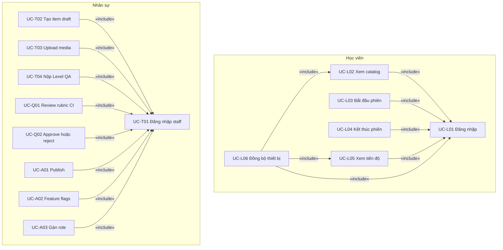
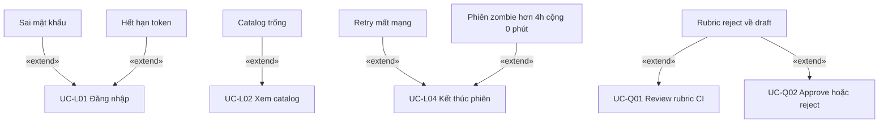
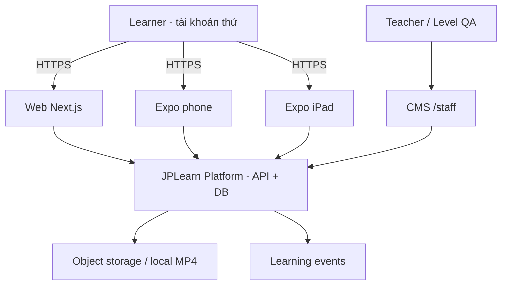
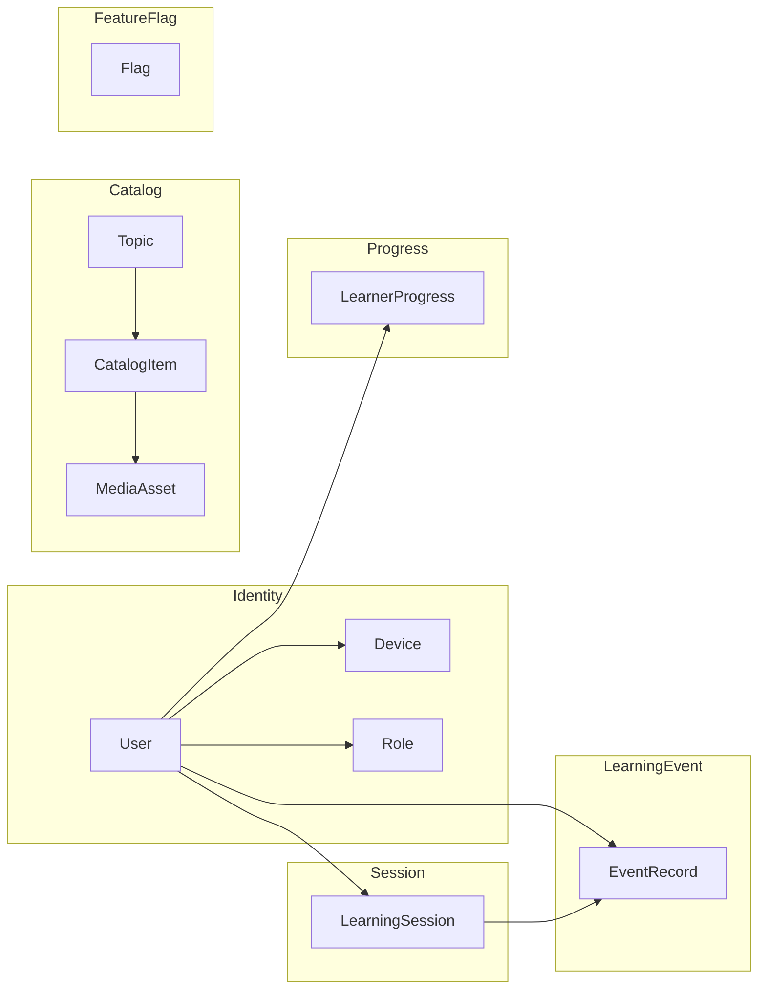
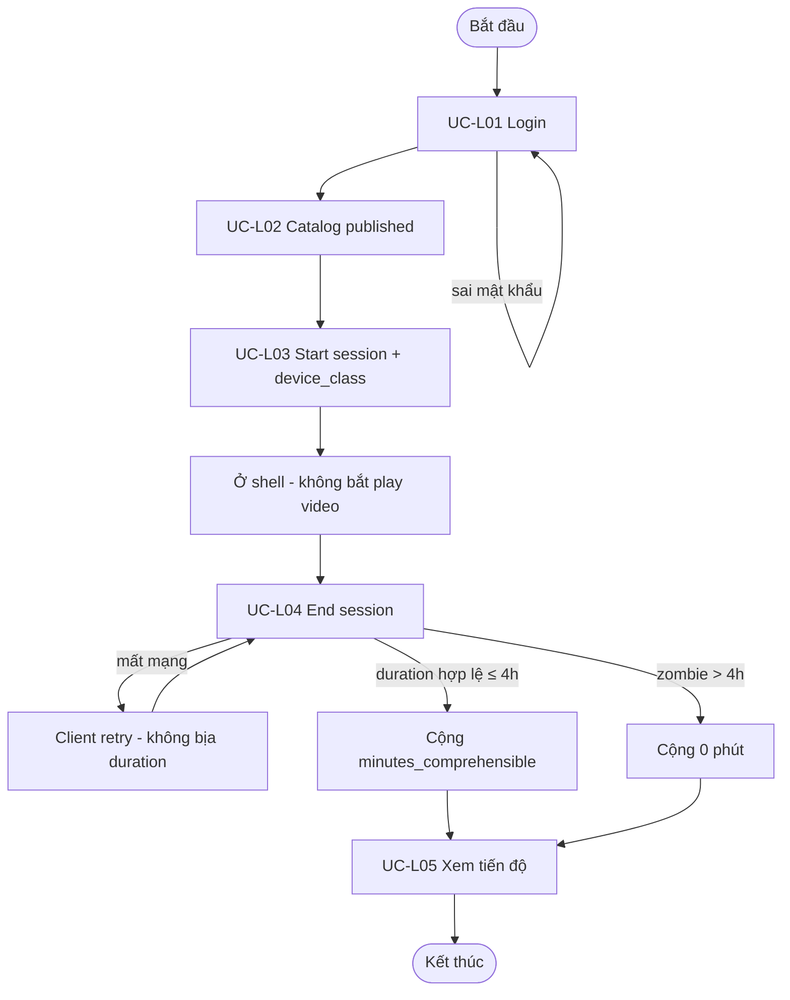
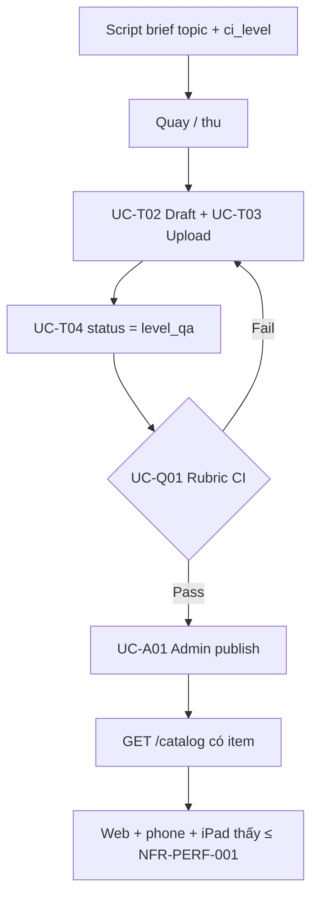

# Sơ đồ phân tích (SAD-2)

Mở file này trên GitHub hoặc preview Markdown để xem diagram. Spec chữ: [use-cases.md](use-cases.md), [context.md](context.md), [processes.md](processes.md), [domain-model.md](domain-model.md). Actor → UC: mục 1. «include» / «extend»: mục 1b.

Phase 5 (`UC-L10`…`UC-L13` phát CI / probe) **không** vẽ trên các sơ đồ v1.

## 1. Use case — nền tảng v1

```mermaid
flowchart TB
  subgraph actors [Actors]
    Learner
    Teacher
    LevelQA
    Admin
  end

  subgraph learnerUC [Học viên]
    L01[UC-L01 Đăng nhập]
    L02[UC-L02 Xem catalog published]
    L03[UC-L03 Bắt đầu phiên]
    L04[UC-L04 Kết thúc phiên]
    L05[UC-L05 Xem phút CI + cấp]
    L06[UC-L06 Đồng bộ thiết bị]
  end

  subgraph staffUC [Nhân sự]
    T01[UC-T01 Đăng nhập staff]
    T02[UC-T02 Tạo item draft]
    T03[UC-T03 Upload media]
    T04[UC-T04 Nộp Level QA]
    Q01[UC-Q01 / Q02 Rubric CI]
    A01[UC-A01 Publish]
    A02[UC-A02 Feature flags]
    A03[UC-A03 Gán role]
  end

  Learner --> L01
  Learner --> L02
  Learner --> L03
  Learner --> L04
  Learner --> L05
  Learner --> L06
  Teacher --> T01
  Teacher --> T02
  Teacher --> T03
  Teacher --> T04
  LevelQA --> Q01
  Admin --> A01
  Admin --> A02
  Admin --> A03
```

Không có use case flashcard, bài ngữ pháp, hay cặp dịch L1 trên client học viên (`FR-NEG-001`…`003`).

## 1b. Quan hệ include / extend

Quy ước mũi tên UML (**không đảo**):

- **«include»:** UC cơ sở `--«include»-->` UC bị include (nhánh luôn thực hiện).
- **«extend»:** UC mở rộng `--«extend»-->` UC cơ sở (tùy chọn / ngoại lệ). Tên extension là alt của UC hiện có — **không** cấp FR id mới.

Mô hình login v1: chặt UML thì đăng nhập là *precondition*; JPLearn v1 vẽ **«include»** vì mọi UC học viên bắt buộc đi qua `UC-L01`, mọi UC nhân sự bắt buộc đi qua `UC-T01`.

Không vẽ chuỗi nhà máy `T02 → T03 → T04 → Q01 → A01` thành include — đó là tuần tự BPMN (mục 5). `UC-A01` (item `published`) là **điều kiện tiên quyết dữ liệu** để `UC-L02` có catalog; ghi chữ, không vẽ include.

`UC-L10`…`UC-L13` (Phase 5) **không** vẽ trên sơ đồ v1.

Association actor → UC: giữ mục 1. `UC-Q02` tách node ở đây vì kịch bản Pass/Reject; mục 1 vẫn gộp nhãn Q01/Q02.

### Include

`UC-L06` include `UC-L02` và `UC-L05`: cùng catalog `published` và cùng progress trên thiết bị khác — khớp spec hiện tại.

### Extend

Chỉ alt/exception đã có trong spec / `processes.md` / sequence SAD-3. Không bịa hành vi mới.

## 2. System context

Ba client **không** đọc Postgres trực tiếp, **không** mở thư mục storage (chỉ URL playback do API cấp).

## 3. Domain — bounded context

`LearnerProgress` chỉ có `minutes_comprehensible` và `current_ci_level`. `ComprehensionProbe` để chỗ schema, không UI v1.

## 4. Quy trình phiên học skeleton

## 5. Quy trình nhà máy nội dung

Cấm nhảy `draft` → `published` bỏ Level QA.
