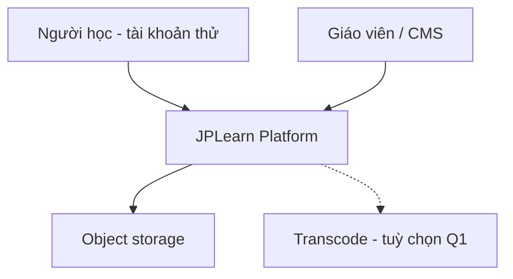
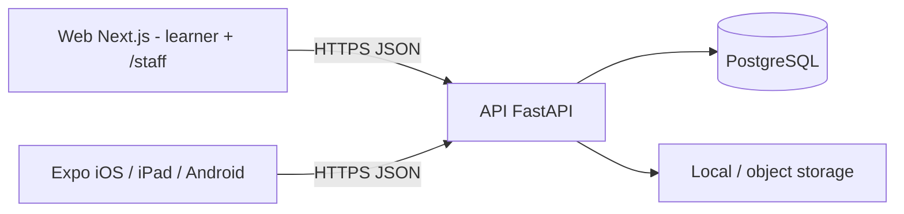
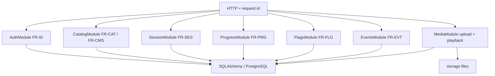
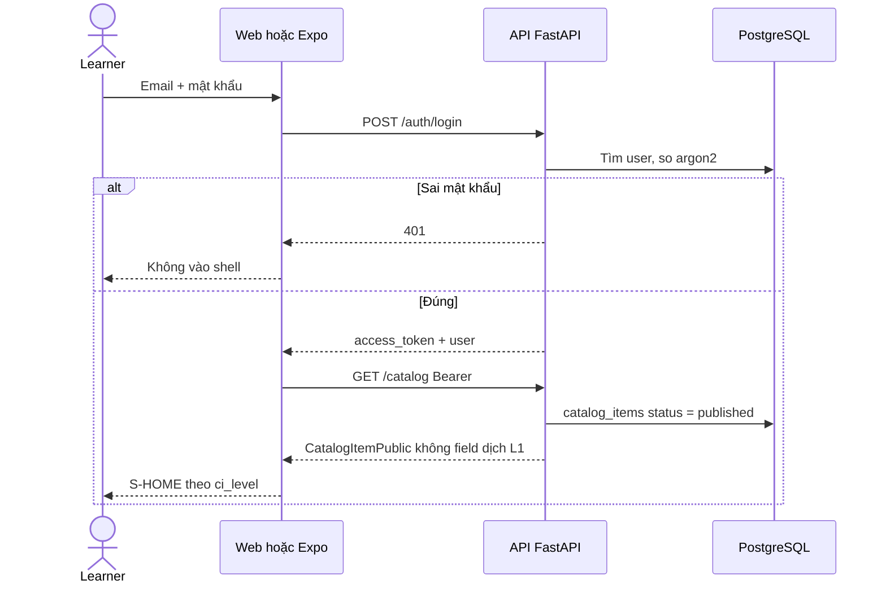
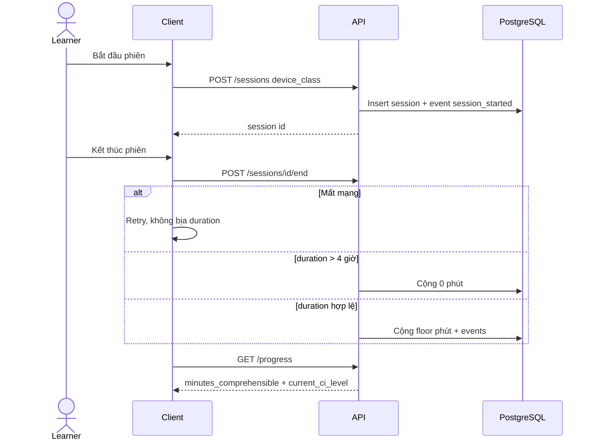
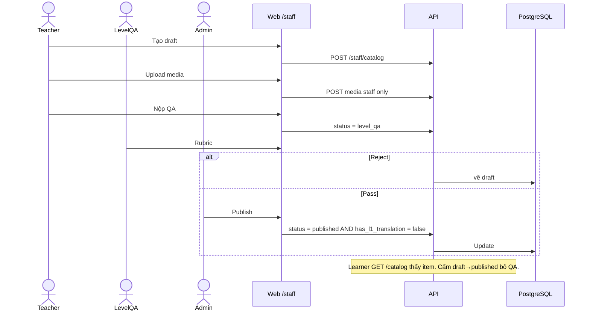
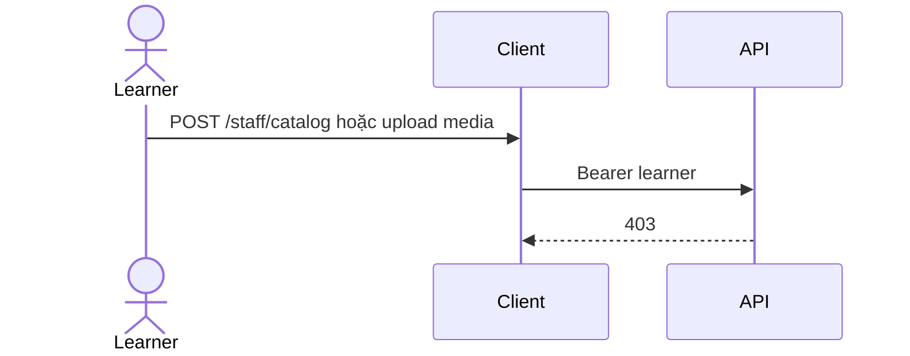
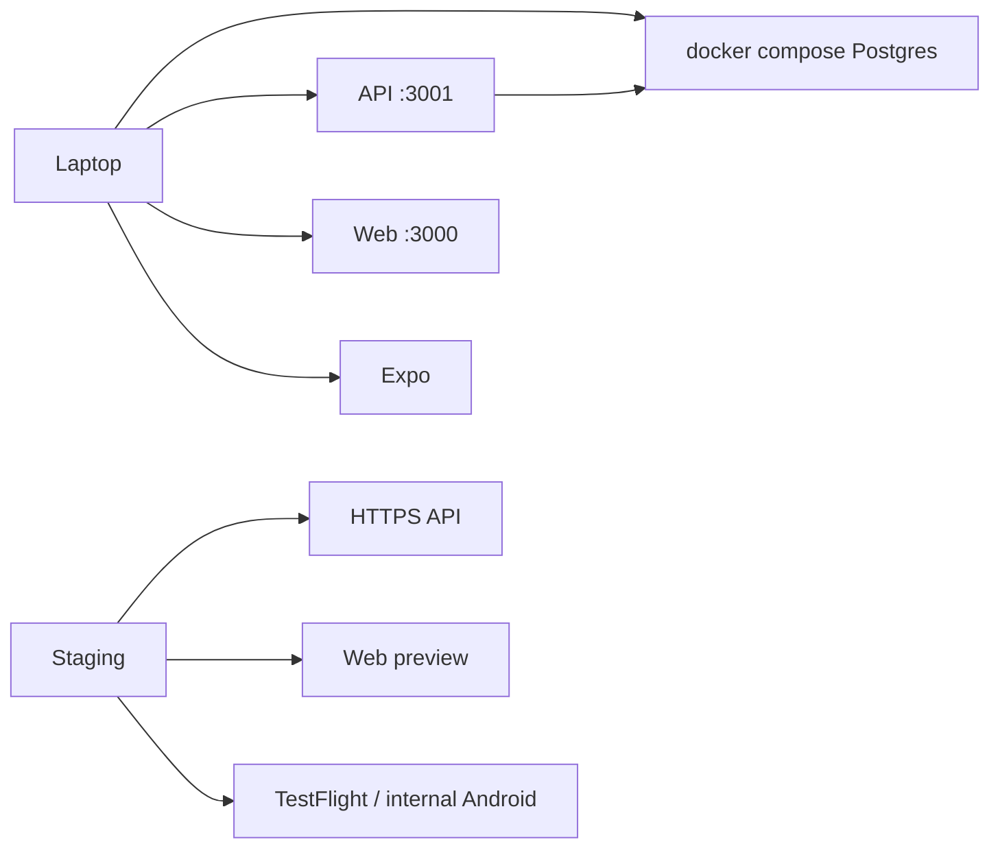

# Sơ đồ thiết kế (SAD-3)

Mở file này trên GitHub hoặc preview Markdown. Spec chữ: [c4.md](c4.md), [erd.md](erd.md), [ui-shell.md](ui-shell.md), [openapi.yaml](openapi.yaml). Khung màn: [wireframes/README.md](wireframes/README.md).

Không có `GrammarModule`, `FlashcardModule`, `TranslationModule`.

## 1. C4 Level 1 — Context

## 2. C4 Level 2 — Container

Client không nói chuyện thẳng với DB. Playback: API trả URL đã ký; Q1 là MP4, HLS trước cổng nền tảng / P5 (`NFR-PERF-002`).

## 3. C4 Level 3 — Component API

## 4. Sequence — đăng nhập và catalog (UC-L01, UC-L02)

## 5. Sequence — kết thúc phiên và phút CI (UC-L03, UC-L04, UC-L05)

## 6. Sequence — CMS publish (UC-T02 … UC-A01)

## 7. Sequence — learner bị cấm CMS (NFR-SEC-002)

## 8. Deploy Q1

Prod không nằm trong Q1.
