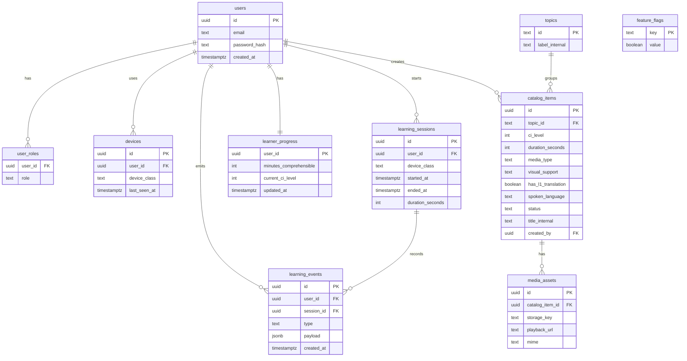

# ERD v1

Sơ đồ container/sequence: [diagrams.md](diagrams.md).

## Migration strategy

1. `0001_foundation` — toàn bộ bảng trên, **không** probes.
2. `0002_probes` — chỉ khi SAD Phase 5.
3. Cấm migration thêm `vocabulary_score` / `grammar_lesson_id` / `translation_vi` trên catalog/progress.

Seed: flags false; topics taxonomy; một admin; catalog trống.
