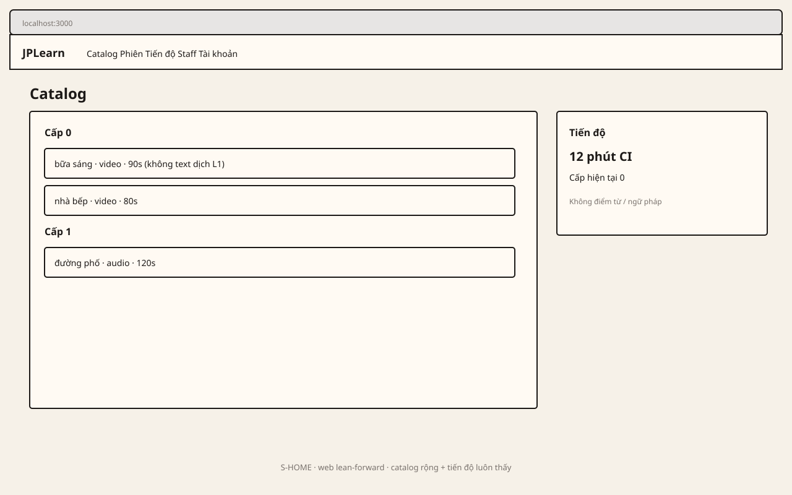

# Khung lo-fi — 5 màn × 3 bề mặt

IA chữ: [../ui-shell.md](../ui-shell.md). Sơ đồ C4/sequence: [../diagrams.md](../diagrams.md).

Lo-fi hộp xám, copy Việt cho chrome, **không** màn ngữ pháp / flashcard / phụ đề L1. iPad không phải phone phóng to.

Mở từng file SVG (GitHub preview được):

| Màn | Phone | iPad | Web |
|---|---|---|---|
| S-LOGIN | [s-login-phone.svg](s-login-phone.svg) | [s-login-ipad.svg](s-login-ipad.svg) | [s-login-web.svg](s-login-web.svg) |
| S-HOME | [s-home-phone.svg](s-home-phone.svg) | [s-home-ipad.svg](s-home-ipad.svg) | [s-home-web.svg](s-home-web.svg) |
| S-SESSION | [s-session-phone.svg](s-session-phone.svg) | [s-session-ipad.svg](s-session-ipad.svg) | [s-session-web.svg](s-session-web.svg) |
| S-PROGRESS | [s-progress-phone.svg](s-progress-phone.svg) | [s-progress-ipad.svg](s-progress-ipad.svg) | [s-progress-web.svg](s-progress-web.svg) |
| S-FLAGS-GATE | [s-flags-gate-phone.svg](s-flags-gate-phone.svg) | [s-flags-gate-ipad.svg](s-flags-gate-ipad.svg) | [s-flags-gate-web.svg](s-flags-gate-web.svg) |

Ví dụ S-HOME web:

Định dạng SVG vector lo-fi (thay PNG). Đủ 15 khung có iPad cho điều kiện artifact cổng SAD-3. Chữ ký người vẫn ghi trên [gates.md](../../../company/gates.md).
